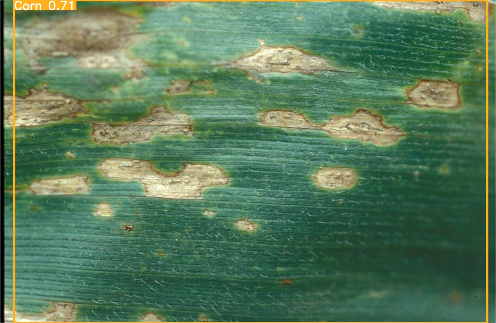

# Leaves-dataset

This repo contains a dataset of leaves, as well as code and tools for training and using models to predict and label leaves in images.

## Table of Contents

- [Colab](#colab)
- [API](#api)
- [Data](#data)
- [Models](#models)
- [Contributing](#contributing)
- [License](#license)
- [Contact](#contact)

## Introduction

Welcome to the Leaves-dataset repository! This project aims to provide a comprehensive dataset of leaves and accompanying tools to train and utilize models for leaf prediction and labeling. Whether you are a researcher, developer, or enthusiast, this repository offers valuable resources for leaf-related tasks.

## Contents

### Colab

The `Colab` directory contains Jupyter Notebook files (`.ipynb`) used for research purposes and training TensorFlow and YOLO models. These notebooks may include data exploration, model development, and evaluation. For more details, explore the [Colab README](Colab/README.md).

### API

The `api` directory hosts a RESTful service that allows users to predict and label leaves in an image. It provides two main methods, `/label` and `/predict`, which take a JSON input containing an `img_url` and return the respective results. If you want to integrate leaf detection into your applications, refer to the [API README](api/README.md) for usage instructions.

### Data

The `data` directory contains three different datasets to support various leaf-related tasks:

- **Amazon Leaves:** A dataset of images showcasing leaves from the Amazon rainforest. Use this dataset for training and testing leaf detection models.

- **Disease Dataset:** A collection of images featuring leaves with various diseases. Use this dataset to train models capable of detecting diseases in different leaf species.

For more details about each dataset, please refer to the [Data README](data/README.md).

### Models

The `models` directory houses pre-trained YOLO and TensorFlow models. These models have been trained using the datasets in the `data` directory and are ready for integration into your applications. For additional information on the models, consult the [Models README](models/README.md).

## License

This project is licensed under the [MIT License](LICENSE).

## Contact

If you have any questions, suggestions, or feedback, please feel free to contact us at [georgezambonin@gmail.com](mailto:georgezambonin@gmail.com).
